# Unsupervised Anomaly Detection via Variational Auto-Encoder
> 通过变分自编码进行无监督异常检测

Haowen Xu, Wenxiao Chen, Nengwen Zhao, Zeyan Li, Jiahao Bu, Zhihan Li, Ying Liu, Youjian Zhao, Dan Pei∗
Tsinghua University

Yang Feng, Jie Chen, Zhaogang Wang, Honglin Qiao
Alibaba Group

## ABSTRACT
> 摘要

To ensure undisrupted business, large Internet companies need to closely monitor various KPIs (e.g., Page Views, number of online users, and number of orders) of its Web applications, to accurately detect anomalies and trigger timely troubleshooting/mitigation. However, anomaly detection for these seasonal KPIs with various patterns and data quality has been a great challenge, especially without labels. In this paper, we proposed Donut, an unsupervised anomaly detection algorithm based on VAE. Thanks to a few of our key techniques, Donut greatly outperforms a state-of-arts supervised ensemble approach and a baseline VAE approach, and its best F-scores range from 0.75 to 0.9 for the studied KPIs from a top global Internet company. We come up with a novel KDE interpretation of reconstruction for Donut, making it the first VAE-based anomaly detection algorithm with solid theoretical explanation.
> 为了确保业务不受干扰，大型互联网公司需要密切监视其Web应用程序的各种KPI（例如，页面浏览量，在线用户数量和订单数量），以准确检测异常并及时进行故障排除/缓解。但是，以各种模式和数据质量对这些周期性KPI进行异常检测一直是一个巨大的挑战，尤其是在没有标签的情况下。本文提出了一种基于VAE的无监督异常检测算法Donut。多亏了我们的一些关键技术，Donut大大胜过了最新的监督集成方法和基准VAE方法，对于一家顶尖的全球互联网公司所研究的KPI，其最佳F-score在0.75到0.9之间。我们为Donut提出了一种新颖的KDE解释重构方法，使其成为第一个基于VAE的具有可靠理论解释的异常检测算法。

CCS CONCEPTS
• Computing methodologies → Anomaly detection; • Information systems → Traffic analysis; 

KEYWORDS
variational auto-encoder; anomaly detection; seasonal KPI

1. INTRODUCTION
> 介绍

To ensure undisrupted business, large Internet companies need to closely monitor various KPIs (key performance indicators) of its Web applications, to accurately detect anomalies and trigger timely troubleshooting/mitigation. KPIs are time series data, measuring metrics such as Page Views, number of online users, and number of orders. Among all KPIs, the most ones are business-related KPIs (the focus of this paper), which are heavily influenced by user behavior and schedule, thus roughly have seasonal patterns occurring at regular intervals (e.g., daily and/or weekly). However, anomaly detection for these seasonal KPIs with various patterns and data quality has been a great challenge, especially without labels.
> 为了确保业务不受干扰，大型互联网公司需要密切监视其Web应用程序的各种KPI（关键性能指标），以准确检测异常并及时进行故障排除/缓解。 KPI是时间序列数据，用于度量指标，例如页面浏览量，在线用户数和订单数。在所有KPI中，最多的是与业务相关的KPI（本文的重点），这些KPI受到用户行为和时间表的严重影响，因此大致有规律的周期性模式发生（例如，每天和/或每周）。但是，以各种模式和数据质量对这些周期性KPI进行异常检测一直是一个巨大的挑战，尤其是在没有标签的情况下。

A rich body of literature exist on detecting KPI anomalies [1, 2, 5–8, 17, 18, 21, 23–27, 29, 31, 35, 36, 40, 41]. As discussed in § 2.2, existing anomaly detection algorithms suffer from the hassle of algorithm picking/parameter tuning, heavy reliance on labels, unsatisfying performance, and/or lack of theoretical foundations.
> 关于检测KPI异常，已有大量文献[1、2、5-8、17、18、21、23-27、29、31、35、36、40、41]。如第2.2节所述，现有的异常检测算法存在算法挑选/参数调整的麻烦，严重依赖标签，性能不令人满意和/或缺乏理论基础的麻烦。

In this paper, we propose Donut, an unsupervised anomaly detection algorithm based on Variational Auto-Encoder (a representative deep generative model) with solid theoretical explanation, and this algorithm can work when there are no labels at all, and can take advantage of the occasional labels when available. 
> 在本文中，我们提出了Donut，这是一种基于变分自动编码器（表示深度生成模型）的无监督异常检测算法，具有扎实的理论解释，该算法可以在完全没有标签的情况下工作，并且可以利用偶尔的标签（如果有）。

The contributions of this paper can be summarized as follows.
- The three techniques in Donut, Modified ELBO and Missing Data Injection for training, and MCMC Imputation for detection, enable it to greatly outperform state-of-art supervised and VAE-based anomaly detection algorithms. The best Fscores of unsupervised Donut range from 0.75 to 0.9 for the studied KPIs from a top global Internet company.
- For the first time in the literature, we discover that adopting VAE (or generative models in general) for anomaly detection requires training on both normal data and abnormal data, contrary to common intuition.
- We propose a novel KDE interpretation in z-space for Donut, making it the first VAE-based anomaly detection algorithm with solid theoretical explanation unlike [2, 36]. This interpretation may benefit the design of other deep generative models in anomaly detection. We discover a time gradient effect in latent z-space, which nicely explain Donut’s excellent performance for detecting anomalies in seasonal KPIs.
> 本文的贡献可归纳如下。
> - Donut的三种技术，改进的ELBO和缺少的数据注入进行训练以及MCMC插补进行检测，这使其在性能上远远超过了最新的监督和基于VAE的异常检测算法。对于来自一家顶级全球互联网公司的研究KPI，无监督的Donut最佳Fscore在0.75到0.9之间。
> - 在文献中，我们首次发现采用VAE（或一般的生成模型）进行异常检测需要对正常数据和异常数据进行训练，这与通常的直觉相反。
> - 我们为Donut提出了一种在z空间中新颖的KDE解释，使其成为第一个基于VAE的异常检测算法，具有不同于[2，36]的可靠理论解释。这种解释可能有益于异常检测中其他深度生成模型的设计。我们发现了潜在z空间中的时间梯度效应，很好地解释了Donut在检测周期性KPI异常方面的出色性能。

2 BACKGROUND AND PROBLEM
2.1 Context and Anomaly Detection in General

> 背景与问题
> 一般情况下的上下文和异常检测

In this paper, we focus on business-related KPIs. These time series are heavily influenced by user behavior and schedule, thus roughly have seasonal patterns occurring at regular intervals (e.g., daily and/or weekly). On the other hand, the shapes of the KPI curves at each repetitive cycle are not exactly the same, since user behavior can vary across days. We hereby name the KPIs we study “seasonal KPIs with local variations”. Examples of such KPIs are shown in Fig 1. Another type of local variation is the increasing trend over days, as can be identified by Holt-Winters [41] and Time Series Decomposition [6]. An anomaly detection algorithm may not work well unless these local variations are properly handled.
> 在本文中，我们专注于与业务相关的KPI。 这些时间序列在很大程度上受到用户行为和时间表的影响，因此大致以规则的间隔（例如，每天和/或每周）发生周期性模式。 另一方面，在每个重复周期中，KPI曲线的形状并不完全相同，因为用户行为可能会随着天变化。 我们在此将我们研究的KPI命名为“具有局部变化的周期性KPI”。 这种KPI的示例如图1所示。另一种局部变化是随着日数的增长趋势，可以通过Holt-Winters [41]和时间序列分解[6]来确定。 除非正确处理了这些局部变化，否则异常检测算法可能无法正常工作。

In addition to the seasonal patterns and local variations of the KPI shapes, there are also noises on these KPIs, which we assume to be independent, zero-mean Gaussian at every point. The exact values of the Gaussian noises are meaningless, thus we only focus on the statistics of these noises, i.e., the variances of the noises.
> 除了KPI形状的季节性变化和局部变化外，这些KPI上还存在噪声，我们认为在每个点上它们都是独立的零均值高斯。高斯噪声的确切值是没有意义的，因此，我们仅关注这些噪声的统计信息，即噪声的方差。

We can now formalize the “normal patterns” of seasonal KPIs as a combination of two components: (1) the seasonal patterns with local variations, and (2) the statistics of the Gaussian noises. We use “anomalies” to denote the recorded points which do not follow normal patterns (e.g., sudden spikes and dips) , while using “abnormal” to denote both anomalies and missing points. See Fig 1 for examples of both anomalies and missing points. Because the KPIs are monitored periodically (e.g., every minute), missing points are recorded as “null” (when the monitoring system does not receive the data) and thus are straightforward to identify. We thus focus on detecting anomalies for the KPIs.
> 现在，我们可以将周期性KPI的“正常模式”形式化为两个组成部分的组合：（1）具有局部变化的周期性模式，以及（2）高斯噪声的统计数据。我们使用“anomalies”来表示不遵循正常模式（例如突然的峰值和跌落）的记录点，而使用“abnormal”来表示异常和缺失点。有关异常anomalies和缺失点的示例，请参见图1。由于KPI是定期（例如，每分钟）进行监视的，因此缺失点被记录为“空”（当监视系统未接收到数据时），因此很容易识别。因此，我们专注于检测KPI的异常anomalies。

Because operators need to deal with the anomalies for troubleshooting/mitigation, some of the anomalies are anecdotally labeled. Note that such occasional labels’ coverage of anomalies are far from what’s needed for typical supervised learning algorithms. 
> 由于操作员需要处理异常以进行故障排除/缓解，因此某些异常会被标记为异常。请注意，此类偶然标签对异常的覆盖范围与典型的监督学习算法所需要的相去甚远。

Anomaly detection on KPIs can be formulated as follows: for any time t, given historical observations xt−T +1, . . . , xt , determine whether an anomaly occurs (denoted by yt = 1). An anomaly detection algorithm typically computes a real-valued score indicating the certainty of having yt = 1, e.g., p(yt = 1|xt−T +1, . . . , xt ), instead of directly computing yt . Human operators can then affect whether to declare an anomaly by choosing a threshold, where a data point with a score exceeding this threshold indicates an anomaly.

> 可以将KPI的异常检测形式化如下：对于任何时间t，给定历史观测值xt-T +1，...，xt，确定是否发生异常（以yt = 1表示）。异常检测算法通常计算表示具有yt = 1的确定性的实值分数，例如p（yt = 1 | xt-T +1，...，xt），而不是直接计算yt。然后，操作员可以通过选择阈值来影响是否声明异常，在该阈值中，得分超过该阈值的数据点表示异常。

2.2 Previous Work
> 之前的工作

Traditional statistical models. Over the years, quite a few anomaly detectors based on traditional statistical models (e.g., [6, 17, 18, 24, 26, 27, 31, 40, 41], mostly time series models) have been proposed to compute anomaly scores. Because these algorithms typically have simple assumptions for applicable KPIs, expert’s efforts need to be involved to pick a suitable detector for a given KPI, and then fine-tune the detector’s parameters based on the training data. Simple ensemble of these detectors, such as majority vote [8] and normalization [35], do not help much either according to [25]. As a result, these detectors see only limited use in the practice.
> 传统的统计模型。多年来，已经提出了许多基于传统统计模型的异常检测器（例如[6、17、18、24、26、27、31、40、41]，主要是时间序列模型）来计算异常评分。由于这些算法通常对适用的KPI具有简单的假设，因此需要专家的努力来为给定的KPI选择合适的检测器，然后根据训练数据对检测器的参数进行微调。根据[25]，这些检测器的简单集合（例如多数表决[8]和归一化[35]）也无济于事。结果，这些检测器在实践中仅得到有限的使用。

Supervised ensemble approaches. To circumvent the hassle of algorithm/parameter tuning for traditional statistical anomaly detectors, supervised ensemble approaches, EGADS [21] and Opprentice [25], were proposed. They train anomaly classifiers using the user feedbacks as labels and using anomaly scores output by traditional detectors as features. Both EGADS and Opprentice showed promising results, but they heavily rely on good labels (much more than the anecdotal labels accumulated in our context), which is generally not feasible in large scale applications. Furthermore, running multiple traditional detectors to extract features during detection introduces lots of computational cost, which is a practical concern.
> 有监督的集成方法。为了规避传统统计异常检测器的算法/参数调整麻烦，提出了有监督的集成方法EGADS [21]和Opprentice [25]。他们使用用户反馈作为标签并使用传统检测器输出的异常评分作为特征来训练异常分类器。 EGADS和Opprentice均显示出令人鼓舞的结果，但是它们严重依赖于良好的标签（远远超过我们所积累的“轶事”标签），这在大规模应用中通常不可行。此外，运行多个传统检测器以在检测期间提取特征会引入大量的计算成本，这是一个实际问题。

Unsupervised approaches and deep generative models. Recently, there is a rising trend of adopting unsupervised machine learning algorithms for anomaly detection, e.g., one-class SVM [1, 7], clustering based methods [9] like K-Means [28] and GMM [23], KDE [29], and VAE [2] and VRNN [36]. The philosophy is to focus on normal patterns instead of anomalies: since the KPIs are typically composed mostly of normal data, models can be readily trained even without labels. Roughly speaking, they all first recognize “normal” regions in the original or some latent feature space, and then compute the anomaly score by measuring “how far” an observation is from the normal regions.
> 无监督的方法和深度生成模型。近来，采用无监督机器学习算法进行异常检测的趋势呈上升趋势，例如，单类SVM [1，7]，基于聚类的方法[9]（例如K-Means [28]和GMM [23]，KDE [ 29]，VAE [2]和VRNN [36]。其理念是专注于正常模式而不是异常：由于KPI通常主要由正常数据组成，因此即使没有标签也可以轻松地训练模型。粗略地说，它们都首先识别原始或某些潜在特征空间中的“正常”区域，然后通过测量观测值与正常区域的“距离”来计算异常分数。

Along this direction, we are interested in deep generative models for the following reasons. First, learning normal patterns can be seen as learning the distribution of training data, which is a topic of generative models. Second, great advances have been achieved recently to train generative models with deep learning techniques, e.g., GAN [13] and deep Bayesian network [4, 39]. The latter is family of deep generative models, which adopts the graphical [30] model framework and variational techniques [3], with the VAE [16, 32] as a representative work. Third, despite deep generative model’s great promise in anomaly detection, existing VAE-based anomaly detection method [2] was not designed for KPIs (time series), and does not perform well in our settings (see § 4), and there is no theoretical foundation to back up its designs of deep generative models for anomaly detection (see § 5). Fourth, simply adopting the more complex models [36] based on VRNN shows long training time and poor performance in our experiments. Fifth, [2] assumes training only on clean data, which is infeasible in our context, while [36] does not discuss this problem.
> 沿着这个方向，出于以下原因，我们对深度生成模型感兴趣。首先，学习正常模式可以看作是学习训练数据的分布，这是生成模型的主题。第二，最近在利用深度学习技术（例如GAN [13]和深度贝叶斯网络[4，39]）训练生成模型方面取得了巨大进展。后者是深度生成模型家族，它采用图[30]模型框架和变分技术[3]，以VAE [16，32]为代表。第三，尽管深度生成模型在异常检测方面具有广阔的前景，但现有的基于VAE的异常检测方法[2]并不是为KPI（时间序列）设计的，并且在我们的设置中效果不佳（请参见§4），并且没有为其用于异常检测的深度生成模型的设计提供支持的理论基础（请参阅第5节）。第四，简单地采用基于VRNN的更复杂的模型[36]，表明在我们的实验中训练时间长且性能差。第五，[2]假定仅对干净数据进行训练，这在我们的上下文中是不可行的，而[36]没有讨论此问题。

2.3 Problem Statement
> 问题陈述

In summary, existing anomaly detection algorithms suffer from the hassle of algorithm picking/parameter tuning, heavy reliance on labels, unsatisfying performance, and/or lack of theoretical foundations. Existing approaches are either unsupervised, or supervised but depending heavily on labels. However, in our context, labels are occasionally available although far from complete, which should be somehow taken advantage of. 
> 总之，现有的异常检测算法存在算法选择/参数调整的麻烦，严重依赖标签，性能不令人满意和/或缺乏理论基础的麻烦。 现有方法要么是非监督模型，要么是监督模型但深度依赖标签。 但是，在我们的上下文中，标签虽然有时还很不完整，但有时还是可用的，应该以某种方式加以利用。

The problem statement of this paper is as follows. We aim at an unsupervised anomaly detection algorithm based on deep generative models with solid theoretical explanation, and this algorithm can take advantage of the occasionally available labels. Because VAE is a basic building block of deep Bayesian network, we chose to start our work with VAE.
> 本文的问题陈述如下。 我们针对基于深度生成模型且具有可靠理论解释的无监督异常检测算法，并且该算法可以利用偶尔可用的标签。 由于VAE是深层贝叶斯网络的基本构建块，因此我们选择开始使用VAE。

2.4 Background of Variational Auto-Encoder
> 变分自动编码器的背景

Deep Bayesian networks use neural networks to express the relationships between variables, such that they are no longer restricted to simple distribution families, thus can be easily applied to complicated data. Variational inference techniques [12] are often adopted in training and prediction, which are efficient methods to solve posteriors of the distributions derived by neural networks.
> 深度贝叶斯网络使用神经网络来表达变量之间的关系，因此它们不再局限于简单的分布，因此可以轻松地应用于复杂的数据。在训练和预测中经常采用变分推理技术[12]，这是解决由神经网络得出的后验分布的有效方法。

VAE is a deep Bayesian network. It models the relationship between two random variables, latent variable z and visible variable x. A prior is chosen for z, which is usually multivariate unit Gaussian N (0, I). After that, x is sampled from pθ(x|z), which is derived from a neural network with parameter θ. The exact form of pθ(x|z) is chosen according to the demand of task. The true posterior pθ(z|x) is intractable by analytic methods, but is necessary for training and often useful in prediction, thus the variational inference techniques are used to fit another neural network as the approximation posterior qϕ(z|x). This posterior is usually assumed to be N (µϕ(x),σ2ϕ(x)), where µϕ (x) and σϕ(x) are derived by neural networks. The architecture of VAE is shown as Fig 2.
> VAE是一个深层的贝叶斯网络。它对两个随机变量（潜在变量z和可见变量x）之间的关系进行建模。为z选择一个先验，它通常是多元单位高斯N（0，I）。此后，从pθ（x | z）采样x，该pθ（x | z）来自具有参数θ的神经网络。根据任务需求选择pθ（x | z）的确切形式。真实的后验pθ（z | x）是解析方法所难解的，但是对于训练而言是必不可少的，并且通常在预测中有用，因此，变分推断技术可用于拟合另一个神经网络作为近似后验qϕ（z | x）。该后验通常假定为N（µϕ（x），σ2ϕ（x）），其中µϕ（x）和σϕ（x）是通过神经网络得出的。 VAE的架构如图2所示。

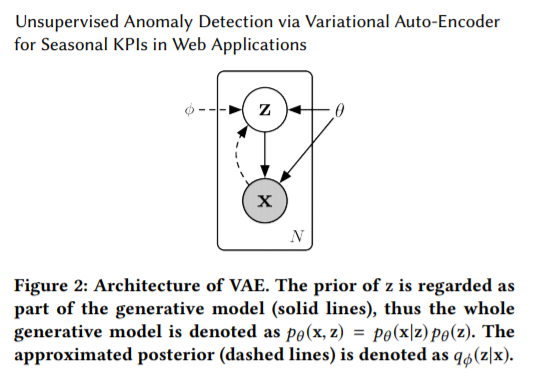

SGVB [16, 32] is a variational inference algorithm that is often used along with VAE, where the approximated posterior and the generative model are jointly trained by maximizing the evidence lower bound (ELBO, Eqn (1)). We did not adopt more advanced variational inference algorithms, since SGVB already works.

Monte Carlo integration [10] is often adopted to approximate the expectation in Eqn (1), as Eqn (2), where z(l) ,l = 1 . . . L are samples from qϕ(z|x). We stick to this method throughout this paper.

> SGVB [16，32]是一种变分推理算法，经常与VAE一起使用，其中通过最大化证据下界来联合训练近似后验模型和生成模型（ELBO，方程（1））。 由于SGVB已经起作用，因此我们没有采用更高级的变分推理算法。
> 
> 通常采用蒙特卡洛积分[10]来近似式（1）中的期望，即式（2），其中z（l），l = 1。 。 。 L是来自qϕ（z | x）的样本。 在整个本文中，我们都坚持使用这种方法。

3 ARCHITECTURE
> 架构

The overall architecture of our algorithm Donut is illustrated as Fig 3. The three key techniques are Modified ELBO and Missing Data Injection during training, and MCMC Imputation in detection.

3.1 Network Structure
> 网络结构

As aforementioned in § 2.1, the KPIs studied in this paper are assumed to be time sequences with Gaussian noises. However, VAE is not a sequential model, thus we apply sliding windows [34] of lengthW over the KPIs: for each point xt, we use xt-W +1, . . . , xt as the x vector of VAE. This sliding window was first adopted because of its simplicity, but it turns out to actually bring an important and beneficial consequence, which will be discussed in § 5.1.
> 如第2.1节所述，本文研究的KPI假定为具有高斯噪声的时间序列。 但是，VAE不是顺序模型，因此我们在KPI上应用lengthW的滑动窗口[34]：对于每个点xt，我们使用xt-W +1，...。 。 。 ，xt作为VAE的x向量。 该滑动窗口由于其简单性而首先被采用，但实际上却带来了重要而有益的结果，将在第5.1节中进行讨论。

The overall network structure of Donut is illustrated in Fig 4, where the components with double-lined outlines (e.g., Sliding Window x, W Dimensional at bottom left) are our new designs and the remaining components are from standard VAEs. The prior pθ (z) is chosen to be N (0, I). Both x and z posterior are chosen to be diagonal Gaussian: pθ (x|z) = N (µx,σx2I), and qϕ(z|x) = N (µz,σz2I), where µx, µz and σx, σz are the means and standard deviations of each independent Gaussian component. z is chosen to be K dimensional. Hidden features are extracted from x and z, by separated hidden layers fϕ(x) and fθ (z). Gaussian parameters of x and z are then derived from the hidden features. The means are derived from linear layers: µx = W⊤µx fθ (z) + bµx and µz = W⊤µz fϕ(x) + bµz . The standard deviations are derived from soft-plus layers, plus a non-negative small number ϵ: σx = SoftPlus[W⊤σx fθ (z) + bσx ] + ϵ and σz = SoftPlus[W⊤σz fϕ(x) + bσz ] + ϵ, where SoftPlus[a] = log[exp(a) + 1]. All the W-s and b-s presented here are parameters of corresponding layers. Note when scalar function f (x) is applied on vector x, it means to apply on every component. 

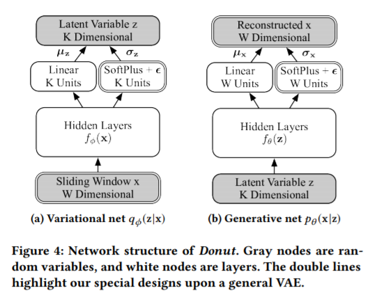

> Donut的整体网络结构如图4所示，其中带有双线轮廓的组件（例如，左下角的：滑动窗口x，W维向量）是我们的新设计，其余组件来自标准VAE。先验的pθ（z）选择为N（0，I）。将x和z的后验均选择为对角高斯：pθ（x | z）= N（µx，σx2I），而qϕ（z | x）= N（µz，σz2I），其中µx，µz和σx，σz为每个独立高斯分量的均值和标准偏差。 z选择为K维。通过分离的隐藏层fϕ（x）和fθ（z）从x和z中提取隐藏特征。然后从隐藏特征中得出x和z的高斯参数。均值来自线性层："见截图"。标准偏差是从soft-plus层加上一个非负小数derived得出的：“见截图”，其中SoftPlus [a] = log [exp（a）+ 1]。这里介绍的所有W-s和b-s是相应层的参数。注意，将标量函数f（x）应用于向量x时，意味着将其应用于每个分量。

We choose to derive σx and σz in such a way, instead of deriving logσx and logσz using linear layers as others do, for the following reason. The local variations in the KPIs of our interest are so small that σx and σz would probably get extremely close to zero, making logσx and logσz unbounded. This would cause severe numerical problems when computing the likelihoods of Gaussian variables.We thus use the soft-plus and the ϵ trick to prevent such problems.

> 我们选择以这种方式导出σx和σz，而不是像其他人那样使用线性层来导出logσx和logσz，原因如下。 我们感兴趣的KPI的局部变化非常小，以至于σx和σz可能非常接近于零，从而使logσx和logσz无界。 在计算高斯变量的可能性时，这将导致严重的数值问题，因此我们使用softplus和ϵ技巧来防止此类问题。

We intentionally choose fully-connected layers as the structure of the hidden layers, making the overall architecture fairly simple. This is because our objective is to develop an VAE based anomaly detection algorithm with solid theoretical explanation, and a simple network structure would definitely make it easier to analyze the internal behavior in the perplexing “variational auto-encoder”.

> 我们有意选择完全连接的层作为隐藏层的结构，从而使整体体系结构相当简单。 这是因为我们的目标是开发具有扎实的理论解释的基于VAE的异常检测算法，并且简单的网络结构无疑将使分析复杂的“可变自动编码器”中的内部行为更加容易。

3.2 Training
> 训练

Training is straightforward by optimizing the ELBO (Eqn (1)) with SGVB [16] algorithm. Since it is reported by [16] that one sample is already sufficient for computing the ELBO when training VAE with the SGVB algorithm, we let sampling number L = 1 during training. We also apply the re-parameterization trick as required by SGVB: instead of sampling z ∼ N (µz,σz2I), a dedicated random variable ξ ∼ N (0, I) is sampled, such that we can rewrite z as z(ξ ) = µz + ξ · σz. Sampling on ξ is independent with the parameters ϕ, which allows us to apply stochastic gradient descent as if VAE is an ordinary neural network. The windows of x are randomly shuffled before every epoch, which is beneficial for stochastic gradient descent. A sufficiently large number of x are taken in every mini-batch, which is critical for stabilizing the training, since sampling introduces extra randomness.
> 通过使用SGVB [16]算法优化ELBO（等式1），训练很简单。由于[16]报告说，当使用SGVB算法训练VAE时，一个样本已经足以计算ELBO，因此在训练期间让采样数L = 1。我们还按照SGVB的要求应用了重新参数化技巧：代替对z〜N（µz，σz2I）进行采样，对专用随机变量ξ〜N（0，I）进行采样，以便将z重写为z（ξ ）= µz +ξ·σz。 ξ上的采样与参数independent无关，这使我们能够像VAE是普通神经网络一样应用随机梯度下降。 x的窗口在每个时期之前随机打乱，这对于随机梯度下降很有用。在每个mini-batch中要获取足够多的x，这对于稳定训练至关重要，因为采样会引入额外的随机性。

As discussed in § 2.2, the VAE based anomaly detection works by learning normal patterns, thus we need to avoid learning abnormal patterns whenever possible. Note that the “anomalies” in training are labeled anomalies, and there can be no labels for a given KPI, in which case the anomaly detection becomes an unsupervised one.
> 如第2.2节所述，基于VAE的异常检测通过学习正常模式来工作，因此我们需要尽可能避免学习abnormal异常模式。请注意，训练中的“异常anomalies”被标记为异常，并且对于给定的KPI可能没有标记，在这种情况下，异常检测将成为无监督的检测。

One might be tempted to replace labeled anomalies (if any) and missing points (known) in training data with synthetically generated values. Some previous work has proposed methods to impute missing data, e.g., [37], but it is hard to produce data that follow the “normal patterns” well enough. More importantly, training a generative model with data generated by another algorithm is quite absurd, since one major application of generative models is exactly to generate data. Using data imputed by any algorithm weaker than VAE would potentially downgrade the performance. Thus we do not adopt missing data imputation before training VAE, instead we choose to simply fill the missing points as zeros (in the Data Preparation step in Fig 3), and then modify the ELBO to exclude the contribution of anomalies and missing points (shown as Modified ELBO (M-ELBO for short hereafter) in the Training step in Fig 3).
> 可能会尝试用合成生成的值替换训练数据中的标记异常（如果有）和缺失点（已知）。先前的一些工作已经提出了填补缺失数据的方法，例如[37]，但是很难产生足够好地遵循“正常模式”的数据。更重要的是，用另一种算法生成的数据训练生成模型是很荒谬的，因为生成模型的一个主要应用就是生成数据。使用由比VAE更弱的算法估算的数据可能会降低性能。因此，我们不会在训练VAE之前采用缺失数据插补，而是选择简单地将缺失点填充为零（在图3中的数据准备步骤中），然后修改ELBO以排除异常和缺失点的影响（修改后的ELBO（以下简称M-ELBO），如图3中的“训练”步骤。

More specifically, we modify the standard ELBO in Eqn (1) to our version Eqn (3). αw is defined as an indicator, where aw = 1 indicates xw being not anomaly or missing, and aw = 0 otherwise. β is defined as (ÍWw=1 αw )/W . Note that Eqn (3) still holds when there is no labeled anomalies in the training data. The contribution of pθ (xw |z) from labeled anomalies and missing points are directly excluded by αw , while the scaling factor β shrinks the contribution of pθ (z) according to the ratio of normal points in x. This modification trains Donut to correctly reconstruct the normal points within x, even if some points in x are abnormal. We do not shrink qϕ(z|x), because of the following two considerations. Unlike pθ (z), which is part of the generative network (i.e., model of the “normal patterns”), qϕ(z|x) just describes the mapping from x to z, without considering“normal patterns”. Thus, discounting the contribution of qϕ(z|x) seems not necessary. Another reason is that Eqϕ (z|x) [− logqϕ(z|x)] is exactly the entropy of qϕ(z|x). This entropy term actually has some other roles in training (which will be discussed in § 5.3), thus might be better kept untouched.

> 更具体地说，我们将等式（1）中的标准ELBO修改为我们的等式（3）。 αw被定义为一个指标，其中aw = 1表示xw没有异常或缺失，否则aw = 0。 β定义为（∑αw）/ W。请注意，当训练数据中没有标记的异常anomalies时，方程（3）仍然成立。 αw直接排除了来自标记异常anomalies和缺失点的pθ（xw | z）的贡献，而缩放因子β根据x中法向点的比率缩小了pθ（z）的贡献。即使x中的某些点异常，此修改也会训练Donut正确地重建x中的法线点。由于以下两个考虑，我们不缩小qϕ（z | x）。与作为生成网络（即“正常模式”的模型）一部分的pθ（z）不同，qϕ（z | x）仅描述了从x到z的映射，而没有考虑“正常模式”。因此，似乎没有必要去掉qϕ（z | x）的贡献。另一个原因是Eqϕ（z | x）[-logqϕ（z | x）]恰好是qϕ（z | x）的熵。这个熵术语实际上在训练中还有其他作用（将在5.3节中讨论），因此最好保持不变。

Besides Eqn (3), another way to deal with anomalies and missing points is to exclude all windows containing these points from training data. This approach turns out to be inferior to M-ELBO. We will demonstrate the performance of both approaches in § 4.5.
> 除了式（3），处理异常和缺失点的另一种方法是从训练数据中排除所有包含这些点的窗口。 事实证明，这种方法不如M-ELBO。 我们将在第4.5节中演示两种方法的性能。

Furthermore, we also introduce missing data injection in training: we randomly set λ ratio of normal points to be zero, as if they are missing points. With more missing points, Donut is trained more often to reconstruct normal points when given abnormal x, thus the effect of M-ELBO is amplified. This injection is done before every epoch, and the points are recovered once the epoch is finished. This missing data injection is shown in the Training step in Fig 3.
> 此外，我们还在训练中引入了缺失数据注入：我们将λ比例的正常点随机设置为零，就好像它们是缺失点一样。 缺失点更多，当给定异常x时，会更频繁地训练Donut来重建正常点，从而增强了M-ELBO的效果。 该注入在每个时期之前完成，并且在时期结束后恢复点。 图3中的Training步骤显示了这种丢失的数据注入。

3.3 Detection
> 检测

Unlike discriminative models which are designed for just one purpose (e.g., a classifier is designed for just computing the classification probability p(y|x)), generative models like VAE can derive various outputs. In the scope of anomaly detection, the likelihood of observation window x, i.e., pθ (x) in VAE, is an important output, since we want to see how well a given x follows the normal patterns. Monte Carlo methods can be adopted to compute the probability density of x, by pθ (x) = Epθ (z) [pθ (x|z)]. Despite the theoretically nice interpretation, sampling on the prior actually does not work well enough in practice, as will be shown in § 4.

> 不同于仅为一个目的而设计的判别模型（例如，为仅计算分类概率p（y | x）而设计的分类器），诸如VAE的生成模型可以得出各种输出。在异常检测的范围内，观察窗x的可能性（即VAE中的pθ（x））是重要的输出，因为我们想知道给定的x遵循正常模式的程度。可以采用蒙特卡洛方法，通过pθ（x）=Epθ（z）[pθ（x | z）]计算x的概率密度。尽管在理论上有很好的解释，但实际上，对先验样本进行采样实际上并不能很好地完成工作，如第4节所示。

Instead of sampling on the prior, one may seek to derive useful outputs with the variational posterior qϕ(z|x). One choice is to compute Eqϕ (z|x) [pθ (x|z)]. Although similar to pθ (x), it is actually not a well-defined probability density. Another choice is to compute Eqϕ (z|x) [logpθ (x|z)], which is adopted in [2], named as “reconstruction probability”. These two choices are very similar. Since only the ordering rather than the exact values of anomaly scores are concerned in anomaly detection, we follow [2] and use the latter one. As an alternative, the ELBO (Eqn (1)) may also be used for approximating logpθ (x), as in [36]. However, the extra term Eqϕ (z|x) [] logpθ (z) − logqϕ(z|x) ] in ELBO makes its internal mechanism hard to understand. Since the experiments in [36] does not support this alternative’s superiority, we choose not to use it. 

> 代替在先验上采样，人们可能会寻求通过后验qϕ（z | x）来得出有用的输出。一种选择是计算等式Eqϕ（z | x）[pθ（x | z）]。尽管与pθ（x）相似，但实际上并不是一个明确定义的概率密度。另一种选择是计算公式[2]中采用的Eqϕ（z | x）[logpθ（x | z）]，称为“重建概率”。这两个选择非常相似。由于在异常检测中只关注异常评分的顺序而不是确切值，因此我们遵循[2]并使用后者。作为替代方案，如[36]中所述，ELBO（等式（1））也可用于近似logpθ（x）。但是，ELBO中的额外项Eqϕ（z | x）[]logpθ（z）-logqϕ（z | x）]使其内部机制难以理解。由于[36]中的实验不支持该替代方法的优越性，因此我们选择不使用它。

During detection, the anomalies and missing points in a testing window x can bring bias to the mapped z, and further make the reconstruction probability inaccurate, which would be discussed in § 5.2. Since the missing points are always known (as “null”), Unsupervised Anomaly Detection via Variational Auto-Encoder for Seasonal KPIs in Web Applications we have the chance to eliminate the biases introduced by missing points. We choose to adopt the MCMC-based missing data imputation technique with the trained VAE, which is proposed by [32]. Meanwhile, we do not know the exact positions of anomalies before detection, thus MCMC cannot be adopted on anomalies.
> 在检测期间，测试窗口x中的异常和缺失点可能给映射的z带来偏差，并进一步使重建概率不准确，这将在5.2节中讨论。 由于遗漏点始终是已知的（“null”），因此通过对Web应用程序中周期性KPI的变分自动编码器进行无监督异常检测，我们有机会消除遗漏点带来的偏差。 我们选择采用由yi已训练的VAE进行的基于MCMC的缺失数据插补技术，该技术由[32]提出。 同时，我们不知道异常在检测之前的确切位置，因此无法对异常采用MCMC。

More specifically, the testing x is divided into observed and missing parts, i.e., (xo, xm). A z sample is obtained from qϕ(z|xo, xm), then a reconstruction sample (x′o, x′m) is obtained frompθ (xo, xm |z). (xo, xm) is then replaced by (xo, x′m), i.e., the observed points are fixed and the missing points are set to new values. This process is iterated for M times, then the final (xo, x′m) is used for computing the reconstruction probability. The intermediate x′m will keep getting closer to normal values during the whole procedure. Given sufficiently large M, the biases can be reduced, and we can get a more accurate reconstruction probability. The MCMC method is illustrated in Fig 5 and is shown in the Detection step in Fig 3.
> 更具体地说，将测试x分为观察到的部分和缺失部分，即（xo，xm）。 从qϕ（z | xo，xm）获得z样本，然后从pθ（xo，xm | z）获得重构样本（x'o，x'm）。 然后将（xo，xm）替换为（xo，x'm），即观察点固定，缺失点设置为新值。 将该过程重复M次，然后将最终值（xo，x'm）用于计算重建概率。 在整个过程中，中间值x'm会越来越接近正常值。 给定足够大的M，可以减少偏差，并且可以获得更准确的重构概率。 MCMC方法在图5中说明，并在图3的“检测”步骤中显示。

After MCMC, we take L samples of z to compute the reconstruction probability by Monte Carlo integration. It is worth mentioning that, although we may compute the reconstruction probability for each point in every window of x, we only use the score for the last point (i.e., xt in xt-T +1, . . . , xt ), since we want to respond to anomalies as soon as possible during the detection. We will still use vector notations in later texts, corresponding to the architecture of VAE. While it is possible to improve the detection performance by delaying the decision and considering more scores for the same point at different times, we leave it as a future work.
> 在MCMC之后，我们取L个z样本通过蒙特卡洛积分来计算重建概率。 值得一提的是，尽管我们可以计算x的每个窗口中每个点的重建概率，但我们仅使用最后一个点的分数（即xt-T+1...，xt中的xt，），因为 我们希望在检测过程中尽快对异常做出响应。 在以后的文本中，我们仍将使用矢量符号，它们与VAE的体系结构相对应。 尽管可以通过延迟决策并在不同时间考虑同一点的更多分数来提高检测性能，但我们将其留作将来的工作。

4 EVALUATION
> 实验评估

4.1 Datasets
> 数据集

We obtain 18 well-maintained business KPIs (where the time span is long enough for training and evaluation) from a large Internet company. All KPIs have an interval of 1 minute between two observations. We choose 3 datasets, denoted as A, B and C, according to Fig 6, so we can evaluate Donut for noises at different levels.We divide each dataset into training, validation and testing sets, whose ratios are 49%, 21%, 30% respectively. Figures of datasets A, B and C are shown in Fig 1, while statistics are shown in Table 1. The operators of the Internet company labeled all the anomalies in these three datasets. For evaluation purpose, we can consider we have the ground truth of all anomalies in these three datasets.
> 我们从一家大型互联网公司获得了18个维护良好的业务KPI（时间跨度足以进行培训和评估）。 所有KPI在两次观察之间的间隔为1分钟。 根据图6我们选择了3个数据集，分别表示为A，B和C，因此我们可以评估Donut在不同级别上的噪声，将每个数据集分为训练集，验证集和测试集，其比率分别为49％，21％， 30％。 数据集A，B和C的数据如图1所示，而统计数据如表1所示。Internet公司的运营商在这三个数据集中标记了所有异常。 出于评估的目的，我们可以认为我们拥有这三个数据集中所有异常的真实情况。

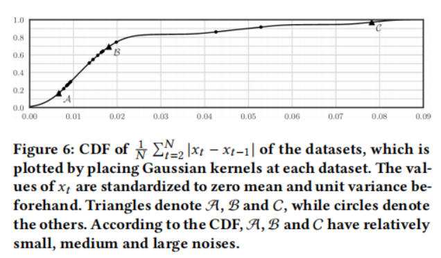

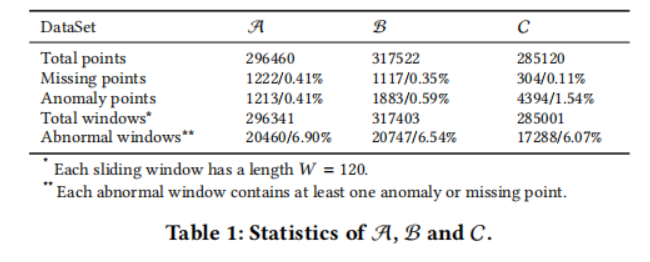

4.2 Performance Metrics
> 性能度量

In our evaluation, we totally ignore outputs of all algorithms at missing points (“null”) since they are straightforward to identify.
> 在我们的评估中，我们完全忽略了所有算法在缺失点（“null”）的输出，因为它们很容易识别。

All the algorithms evaluated in this paper compute one anomaly score for each point. A threshold can be chosen to do the decision: if the score for a point is greater than the threshold, an alert should be triggered. In this way, anomaly detection is similar to a classification problem, and we may compute the precision and recall corresponding to each threshold. We may further compute the AUC, which is the average precision over recalls, given all possible thresholds; or the F-score, which is the harmonic mean of precision and recall, given one particular threshold. We may also enumerate all thresholds, obtaining all F-scores, and use the best F-score as the metric. The best F-score indicates the best possible performance of a model on a particular testing set, given an optimal global threshold. In practice, the best F-score is mostly consistent with AUC, except for slight differences (see Fig 8). We prefer the best F-score to AUC, since it should be more important to have an excellent F-score at a certain threshold than to have just high but not so excellent F-scores on most thresholds. 
> 本文评估的所有算法都会为每个点计算一个异常分数。可以选择一个阈值来做出决定：如果某个点的得分大于阈值，则应该触发警报。这样，异常检测就类似于分类问题，并且我们可以计算与每个阈值相对应的精度和召回率。给定所有可能的阈值，我们可以进一步计算AUC，即召回率的平均精度；或F分数，它是给定一个特定阈值的精度和召回率的谐波平均值。我们还可能枚举所有阈值，获得所有F分数，并使用最佳F分数作为度量。给定最佳全局阈值，最好的F分数表示模型在特定测试集上的最佳性能。在实践中，最佳F分数与AUC基本一致，除了细微差异（见图8）。相对于AUC，我们更喜欢最好的F分数，因为在某个阈值上拥有出色的F分数比在大多数阈值上拥有高但不是那么出色的F分数更为重要。

In real applications, the human operators generally do not care about the point-wise metrics. It is acceptable for an algorithm to trigger an alert for any point in a contiguous anomaly segment, if the delay is not too long. Some metrics for anomaly detection have been proposed to accommodate this preference, e.g., [22], but most are not widely accepted, likely because they are too complicated. We instead use a simple strategy: if any point in an anomaly segment in the ground truth can be detected by a chosen threshold, we say this segment is detected correctly, and all points in this segment are treated as if they can be detected by this threshold. Meanwhile, the points outside the anomaly segments are treated as usual. The precision, recall, AUC, F-score and best F-score are then computed accordingly. This approach is illustrated in Fig 7.
> 在实际应用中，操作员通常并不关心逐点度量。如果延迟不太长，则算法可以对连续异常段中任何点触发警报。已经提出了一些用于异常检测的度量来适应这种偏好，例如，[22]，但是大多数度量没有被广泛接受，这可能是因为它们太复杂了。相反，我们使用一种简单的策略：如果可以通过选定的阈值检测到异常段中的任何点，那么我们就可以正确地检测到该段，并且将该段中的所有点都视为可以被此阈值检测到。同时，异常段外的点将照常处理。然后，相应地计算精度，召回率，AUC，F分数和最佳F分数。图7中说明了这种方法。

In addition to the accuracy metric, we compute the alert delay for each detected segment, which is also important to the operators. For a true positive segment, the alert delay is the time difference between the first point and the first detected point in the segment.
> 除了准确性指标外，我们还为每个检测到的段计算警报延迟，这对于操作员也很重要。对于真正的正分段，警报延迟是分段中第一个点与第一个检测到的点之间的时间差。

4.3 Experiment Setup
> 实验准备

We set the window size W to be 120, which spans 2 hours in our datasets. The choice of W is restricted by two factors. On the one hand, too small a W will cause the model to be unable to capture the patterns, since the model is expected to recognize what the normal pattern is with the information only from the window (see § 5.1). On the other hand, too large a W will increase the risk of over-fitting, since we stick to fully-connected layers without weight sharing, thus the number of model parameters is proportional to W . We set the latent dimension K to be 3 for B and C, since the 3-d dimensional space can be easily visualized for analysis and luckily K = 3 works well empirically for for B and C. As for A, we found 3 is too small, so we empirically increase K to 8. These empirical choices of K are proven to be quite good on testing set, as will be shown in Fig 10. The hidden layers of qϕ(z|x) and pθ (x|z) are both chosen as two ReLU layers, each with 100 units, which makes the variational and generative network have equal size. We did not carry out exhaustive search on the structure of hidden networks. 
> 我们将窗口大小W设置为120，在我们的数据集中跨越2个小时。 W的选择受到两个因素的限制。一方面，W太小将导致模型无法捕获模式，因为仅使用来自窗口的信息，模型才可以识别出正常模式（请参阅第5.1节）。另一方面，W太大会增加过度拟合的风险，因为我们坚持没有权重共享的全连接层，因此模型参数的数量与W成正比。我们将B和C的潜在维K设置为3，因为3维空间可以很容易地可视化以进行分析，幸运的是，对于B和C，K = 3在经验上很有效。至于A，我们发现3也是较小，因此我们将K经验性地增加到8。如图10所示，在测试集上证明了K的这些经验选择是很好的。qϕ（z | x）和pθ（x | z）的隐藏层都被选为两个ReLU层，每个层有100个单位，这使得variational网络和generative网络具有相同的大小。我们没有对隐藏网络的结构进行详尽的搜索。

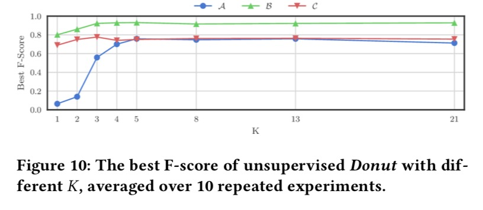

Other hyper-parameters are also chosen empirically. We use $10^{-4}$ as ϵ of the std layer. We use 0.01 as the injection ratio λ. We use 10 as the MCMC iteration count M, and use 1024 as the sampling number L of Monte Carlo integration. We use 256 as the batch size for training, and run for 250 epochs. We use Adam optimizer [15], with an initial learning rate of $10^{-3}$ . We discount the learning rate by 0.75 after every 10 epochs. We apply L2 regularization to the hidden layers, with a coefficient of $10^{-3}$ . We clip the gradients by norm, with a limit of 10.0.
> 还可以凭经验选择其他超参数。 我们将 $10^{-4}$ 用作std层的ϵ。 我们使用0.01作为注入比λ。 我们使用10作为MCMC迭代计数M，并使用1024作为蒙特卡洛积分的采样数L。 我们使用256作为训练的批次大小，并运行250个纪元。 我们使用Adam优化器[15]，初始学习率为 $10^{-3}$ 。 每10个周期我们将学习率降低0.75。 我们对隐藏层应用L2正则化，系数为 $10^{-3}$ 。 我们按标准裁剪渐变，限制为10.0。

In order to evaluate Donut with no labels, we ignore all the labels. For the case of occasional labels, we down-sample the anomaly labels of training and validation set to make it contain 10% of labeled anomalies. Note that missing points are not down-sampled. We keep throwing away anomaly segments randomly, with a probability that is proportional to the length of each segment, until the desired down-sampling rate is reached. We use this approach instead of randomly throwing away individual anomaly points, because KPIs are time sequences and each anomaly point could leak information about its neighboring points, resulting in over-estimated performance. Such downsampling are done 10 times, which enables us to do 10 independent, repeated experiments. Overall for each dataset, we have three versions: 0% labels, 10% labels, and 100% labels.
> 为了评估没有标签的Donut，我们将忽略所有标签。 对于偶发标签，我们对训练和验证集的异常标签进行下采样，以使其包含10％的标记异常。 请注意，缺失点不会被下采样。 我们一直随机丢弃异常片段，其概率与每个片段的长度成正比，直到达到所需的下采样率。 我们使用这种方法，而不是随机丢弃单个异常点，因为KPI是时间序列，并且每个异常点都可能泄漏有关其相邻点的信息，从而导致性能被高估。 这样的下采样完成了10次，这使我们能够进行10个独立的重复实验。 对于每个数据集，总体而言，我们有三个版本：0％标签，10％标签和100％标签。

4.4 Overall Performance
> 整体表现

We measure the AUC, the best F-Score, and the average alert delay corresponding to the best F-score in Fig 8 of Donut, and compared with three selected algorithms.
> 我们测量了AUC，最佳F分数以及对应于Donut图8中最佳F分数的平均警报延迟，并与三种选定算法进行了比较。

Opprentice [25] is an ensemble supervised framework using Random Forest classifier. On datasets similar to ours, Opprentice is reported to consistently and significantly outperform 14 anomaly detectors based on traditional statistical models (e.g., [6, 17, 18, 24, 26, 27, 31, 40, 41]), with in total 133 enumerated configurations of hyper-parameters for these detectors. Thus, in our evaluation of Donut, Opprentice not only serves as a state-of-art competitor algorithm from the non deep learning areas, but also serves as a proxy to compare with the empirical performance “upper bound" of these traditional anomaly detectors.
> Opprentice [25]是使用随机森林分类器的集成监督框架。 在与我们相似的数据集上，据报告，Opprentice在传统统计模型（例如[6、17、18、24、26、27、31、40、41]）的基础上，在性能上始终显着优于14个异常检测器，这些检测器具有133项超参数配置。 因此，在我们对Donut的评估中，Opprentice不仅是非深度学习领域的最先进的竞争者算法，而且还是与这些传统异常检测器的经验性能“上限”进行比较的代理。

VAE baseline. The VAE-based anomaly detection in [2] does not deal with time sequences, thus we set up the VAE baseline as follows. First, the VAE baseline has the same network structure as Donut, as shown in Fig 4. Second, among all the techniques in Fig 3, only those techniques in the Data Preparation step are used. Third, as suggested by [2], we exclude all windows containing either labeled anomalies or missing points from training data.
> VAE基准。 [2]中基于VAE的异常检测不处理时间序列，因此我们按以下方法设置VAE基线。 首先，VAE基准具有与Donut相同的网络结构，如图4所示。其次，在图3中的所有技术中，仅使用“数据准备”步骤中的那些技术。 第三，正如[2]所建议的，我们从训练数据中排除所有包含标记异常或缺失点的窗口。

Donut-Prior. Given that a generative model learns p(x) by nature, while in VAE p(x) is defined as Epθ (z) [pθ (x|z)], we also evaluate the prior counterpart of reconstruction probability, i.e., Epθ (z) [log pθ (x|z)]. We just need a baseline of the prior, so we compute the prior expectation by plain Monte Carlo integration, without advanced techniques to improve the result.
> Donut-先验。 假设生成模型自然学习p（x），而在VAE中p（x）定义为Epθ（z）[pθ（x | z）]，我们还评估了重建概率的prior counterpart，即Epθ（ z）[logpθ（x | z）]。 我们只需要先验的基线，因此我们可以通过简单的蒙特卡洛积分来计算先验期望，而无需使用先进的技术来改善结果。

The best F-score of Donut is quite satisfactory in totally unsu- pervised case, ranges from 0.75 to 0.9, better than the supervised Opprentice in all cases. In fact, when labels are incomplete, the best F-score of the Opprentice drops heavily in A and B, only re- maining acceptable in C. The number of anomalies are much larger in C than A and B, while having 10% of labels are likely to be just enough for training. Donut has an outstanding performance in the unsupervised scenario, and we see that feeding anomaly labels into Donut would in general make it work even better. There is, however, an unusual behavior of Donut, where the best F-score in C, as well as the AUC in B and C, are slightly worse with 100% labels than 10%. This is likely an optimization problem, where the unlabeled anomalies might cause training to be unstable, and ac- cidentally pull the model out of a sub-optimal equilibrium (§ 5.4). Such phenomenon seems to diminish when K increases from 3 (B and C) to 8 (A). Fortunately, it does not matter too much, so we would suggest to use labels in Donut whenever possible.
> Donut的最佳F分数在完全不受监督的情况下是令人满意的，范围从0.75到0.9，在所有情况下都优于监督的Opprentice。实际上，当标签不完整时，Opprentice的最佳F分数会在A和B中大幅下降，而在C中仍保持可接受的水平。C中的异常数比A和B大得多，而C的异常数则为10％。标签可能足以进行培训。 Donut在无人监督的情况下具有出色的性能，我们看到将异常标签输入Donut通常会使它工作得更好。但是，Donut有一种不寻常的行为，在C中，最好的F分数以及B和C中的AUC在使用100％标签的情况下要比在10％情况下差一些。这可能是一个优化问题，未标记的异常可能会导致训练不稳定，并偶然使模型脱离次优均衡状态（第5.4节）。当K从3（B和C）增加到8（A）时，这种现象似乎消失了。幸运的是，这并不太重要，因此我们建议尽可能在Donut中使用标签。

Donut outperforms the VAE baseline by a large margin in A and B, while it does not show such great advantage in C. In fact, the relative advantage of Donut is the largest in A, medium in B, and the smallest in C. This is caused by the following reasons. Naturally, VAE models normal x. As a result, the reconstruction probability actually expects x to be mostly normal (see § 5.1). However, since x are sliding windows of KPIs and we are required to produce one anomaly score for every point, it is sometimes inevitable to have abnormal points in x. This causes the VAE baseline to suffer a lot. In contrast, the techniques developed in this paper enhances the ability of Donut to produce reliable outputs even when anomalies present in earlier points in the same window. Meanwhile, abnormal points with similar abnormal magnitude would appear relatively “more abnormal” when the KPI is smoother. Given that A is the smoothest, B is medium, and C is the least smoothest, above observation in the relative advantage is not surprising.
> 在A和B中，Doughnut的表现要比VAE基线好得多，而在C中却没有表现出如此大的优势。事实上，Doughnut的相对优势在A中最大，在B中中等，在C中最小。是由以下原因引起的。VAE对normal的x建模。结果，重建概率实际上期望x基本上是normal的（请参阅第5.1节）。但是，由于x是KPI的滑动窗口，并且要求我们为每个点生成一个异常分数，因此x中有时会不可避免地出现异常点。这导致VAE基线遭受很大损失。相反，本文开发的技术增强了Donut产生可靠输出的能力，即使在同一窗口的较早点出现异常时也是如此。同时，当KPI更平滑时，具有相似异常大小的异常点将显示为“更异常”。假设A是最平滑的，B是中等的，C是最不平滑的，因此在相对优势之上进行观察不足为奇。

Finally, the best F-score of the Donut-Prior is much worse than the reconstruction probability, especially when the dimension of z is larger. However, it is worth mentioning that the posterior expectation in reconstruction probability only works under certain conditions (§ 5.2). Fortunately, this problem does not matter too much to Donut (see § 5.2). As such, the reconstruction probability can be used without too much concern.
> 最后，Donut-Prior的最佳F分数比重建概率差得多，尤其是在z的维数较大时。 但是，值得一提的是，重建概率的后验仅在某些条件下有效（第5.2节）。 幸运的是，这个问题对Donut来说并没有太大关系（请参阅§5.2）。 这样，无需过多担心就可以使用重建概率。

The average alert delays of Donut, Opprentice and VAE Base- line are acceptable over all datasets, whereas Donut-Prior is not. Meanwhile, the best F-score of Donut is much better than others. In conclusion, Donut could achieve the best performance without increasing the alert delay, thus Donut is practical for operators.
> Donut，Opprentice和VAE Baseline的平均警报延迟在所有数据集中都是可接受的，而Donut-Prior则不是。 同时，Donut的最佳F得分远胜于其他。 总而言之，Donut可以在不增加警报延迟的情况下达到最佳性能，因此Donut对操作员而言是实用的。

4.5 Effects of Donut Techniques
> Donut技术的贡献

We have proposed three techniques in this paper: (1) M-ELBO (Eqn (3)), (2) missing data injection, and (3) MCMC imputation. In Fig 10, we present the best F-score of Donut with four possible combinations of these techniques, plus the VAE baseline for compar- ison. These techniques are closely related to the KDE interpretation, which will be discussed further in § 5.2.
> 我们在本文中提出了三种技术：（1）M-ELBO（等式（3）），（2）缺少的数据注入，以及（3）MCMC推理。 在图10中，我们给出了Donut的最佳F分数以及这些技术的四种可能组合，以及用于比较的VAE基线。 这些技术与KDE解释密切相关，将在5.2节中进一步讨论。

M-ELBO alone contributes most of the improvement over the VAE baseline. It works by training Donut to get used to possible abnormal points in x, and to produce desired outputs in such cases. Although we expected M-ELBO to work, we did not expect it to work such well. In conclusion, it would not be a good practice to train a VAE for anomaly detection using only normal data, although it seems natural for a generative model (§ 5.2). To the best of our knowledge, M-ELBO and its importance have never been stated in previous work, thus is a major contribution of ours.
> 仅M-ELBO就能在VAE基准上做出大部分改进。 它通过训练Donut来适应x中可能出现的异常点并在这种情况下产生所需的输出而起作用。 尽管我们期望M-ELBO能够工作，但是我们并不期望它能如此出色。 总之，尽管对于生成模型来说很自然（第5.2节），但仅使用正常数据来训练VAE以进行异常检测并不是一个好习惯。 据我们所知，M-ELBO及其重要性从未在以前的工作中提到过，因此是我们的重大贡献。

Missing data injection is designed for amplifying the effect of M-ELBO, and can actually be seen as a data augmentation method. In fact, it would be better if we inject not only missing points, but also synthetically generated anomalies during training. However, it is difficult to generate anomalies similar enough to the real ones, which should be a large topic and is out of the scope of this paper. We thus only inject the missing points. The improvement of best F-score introduced by missing data injection is not very significant, and in the case of 0% labels on B and C, it is slightly worse than M-ELBO only. This is likely because the injection introduces extra randomness to training, such that it demands larger training epochs, compared to the case of M-ELBO only. We are not sure how many number of epochs to run when the injection is adopted, in order to get an objective comparison, thus we just use the same epochs in all cases, leaving the result as it is. We still recommend to use missing data injection, even with a cost of larger training epochs, as it is expected to work with a large chance.
> 丢失数据注入是为增强M-ELBO的效果而设计的，实际上可以看作是一种数据增强方法。实际上，如果我们不仅在训练过程中注入缺失点，而且还注入合成产生的异常，那将更好。但是，很难产生足够接近真实异常的异常，这应该是一个大话题，不在本文讨论范围之内。因此，我们仅注入遗漏的点。由于缺少数据注入而导致的最佳F分数的提高不是很明显，并且在B和C上标记为0％的情况下，仅比M-ELBO差一点。这可能是因为与仅使用M-ELBO的情况相比，注入会给训练带来额外的随机性，因此需要更大的训练时间。我们不确定采用注入时要运行多少个时期，以便进行客观比较，因此我们在所有情况下都使用相同的时期，结果保持不变。我们仍然建议使用丢失的数据注入方法，即使付出较大的训练时机也是如此，因为这种方法很有可能会起作用。

MCMC imputation is also designed to help Donut deal with abnormal points. Although Donut obtains significant improvement of best F-score with MCMC in only some cases, it never harms the performance. According to [32], this should be an expected result. We thus recommend to always adopt MCMC in detection.
> MCMC推断还旨在帮助Donut处理异常点。 尽管Donut仅在某些情况下使用MCMC获得了最佳F评分的显着改善，但它从未损害性能。 根据[32]，这应该是预期的结果。 因此，我们建议在检测中始终采用MCMC。

In conclusion, we recommend to use all the three techniques of Donut. The result of such configuration is also presented in Fig 9.
> 总之，我们建议使用Donut的所有三种技术。 这种配置的结果也显示在图9中。

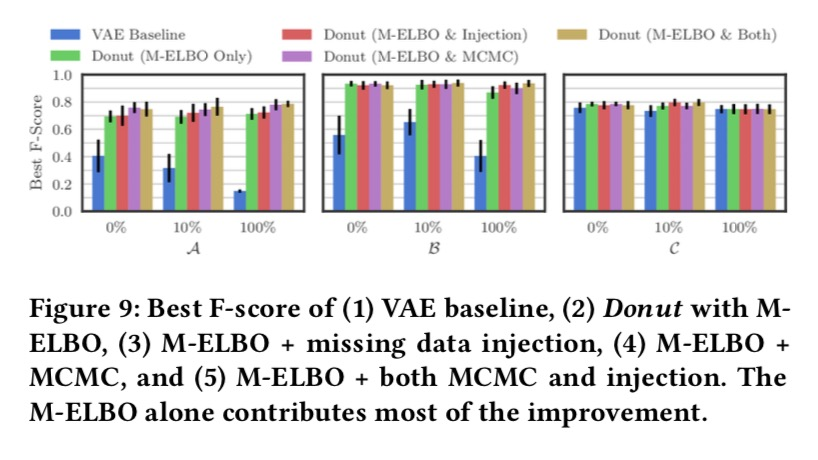

4.6 Impact of K
> K值的影响

The number of z dimensions, i.e., K, plays an important role. Too small a K would potentially cause under-fitting, or sub-optimal equilibrium (see § 5.4). On the other hand, too large a K would probably cause the reconstruction probability unable to find a good posterior (see § 5.1). It is difficult to choose a good K in totally unsupervised scenario, thus we leave it as a future work.
> z维数，即K，起着重要的作用。 K太小可能会导致拟合不足或次优平衡（请参见第5.4节）。 另一方面，K太大可能会导致重建概率无法找到好的后验概率（请参阅第5.1节）。 在完全不受监督的情况下很难选择一个好的K，因此我们将其留作未来的工作。

In Fig 10, we present the average best F-score with different K on testing set for unsupervised Donut. This does not help us choose the best K (since we cannot use testing test to pick K), but can show our empirical choice of 8, 3, 3 is quite good. The best F-score reaches maximum at 5 for A, 4 for B and 3 for C. In other words, the best F-score could be achieved with fairly small K . On the other hand, the best F-score does not drop too heavily for K up to 21. This gives us a large room to empirically choose K. Finally, we notice that smoother KPIs seem to demand larger K. Such phenomenon is not fully studied in this paper, and we leave it as a future work. Based on the observations in Fig 10, for KPIs similar to A, B or C, we suggest an empirical choice of K within the range from 5 to 10.
> 在图10中，我们给出了无监督Donut测试集上具有不同K的平均最佳F分数。 这并不能帮助我们选择最佳K（因为我们不能使用测试来选择K），但是可以证明我们的经验选择8、3、3很好。 最佳F分数最大达到A的5分，B的4分和C的3分。换句话说，最佳的F分数可以用相当小的K来实现。 另一方面，最佳F分数对于K取值上限到21的下降不会太大。这为我们提供了较大的经验选择K的空间。最后，我们注意到较平滑的KPI似乎需要更大的K。这种现象在本文中并不完全进行了研究，我们将其留作将来的工作。 基于图10中的观察结果，对于类似于A，B或C的KPI，我们建议根据经验选择K，范围为5到10。

5 ANALYSIS
> 分析

5.1 KDE Interpretation
> KDE解释

Although the reconstruction probability Eqφ (z |x) [log pθ (x|z)] has been adopted in [2, 36], how it actually works has not yet been madeclear. Some may see it a savariant of Eq (z|x)[pθ(x|z)], but Eqφ (z |x) [pθ (x|z)] = $\int$ pθ (x|z)qφ (z|x)dz, which is definitely not a well-defined probability*. Thus neither of [2, 36] can be explained by the probabilistic framework. We hereby propose the KDE (kernel density estimation) interpretation for the reconstruction probability, and for the entire Donut algorithm.
> 尽管在[2，36]中采用了重建概率Eqφ（z | x）[logpθ（x | z）]，但尚不清楚它的实际工作方式。 有人可能会看到它是Eq（z | x）[pθ（x | z）]的变数，但Eqφ（z | x）[pθ（x | z）] = $\int$ pθ（x | z）qφ（z | x） dz，绝对不是定义明确的概率*。 因此，[2，36]都不能用概率框架来解释。 我们在此提出针对重建概率以及整个Donut算法的KDE（内核密度估计）解释。

*In general it should give no useful information by computing the expectation of log pθ (x |z) upon the posterior qφ (z |x), using a potentially abnormal x.
> 通常，使用潜在的异常x，通过计算基于后验qφ(z | x)的log pθ(x | z)的期望，不应提供有用的信息。

The posterior qφ (z|x) for normal x exhibits time gradient, as Fig 11a shows. The windows of x at contiguous time (contiguous x for short hereafter) are mapped to nearby qφ (z|x), mostly with small variance σz (see Fig 12). The qφ (z|x) are thus organized in smooth transition, causing z samples to exhibit color gradient in the figure. We name this structure “time gradient”. The KPIs in this paper are smooth in general, so contiguous x are highly similar. The root cause of time gradient is the transition of qφ (z|x) in the shape of x (rather than the one in time), because Donut consumes only the shape of x and no time information. Time gradient benefits the generalization of Donut on unseen data: if we have a posterior qφ (z|x) somewhere between two training posteriors, it would be well-defined, avoiding absurd detection output.
> 如图11 a所示，normal x的后验qφ（z | x）呈现时间梯度。 x的连续时间窗口（以下简称连续x）映射到附近的qφ（z | x），大多数情况下方差σz小（请参见图12）。 因此，qφ（z | x）平滑过渡，使z个样本在图中呈现颜色渐变。 我们将此结构称为“时间梯度”。 本文中的KPI总体上是平滑的，因此连续的x非常相似。 时间梯度的根本原因是qφ（z | x）呈x形状（而不是时间上的一个）的过渡，因为Donut仅消耗x的形状而没有时间信息。 时间梯度有利于在看不见的数据上推广Donut：如果我们在两个训练后验者之间的某个地方有一个后验qφ（z | x），则它将得到明确定义，避免了荒谬的检测输出。

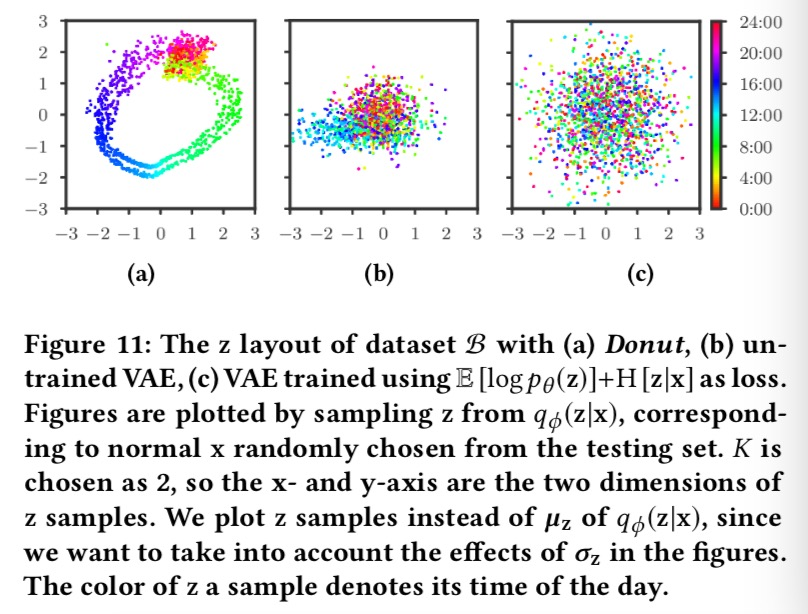

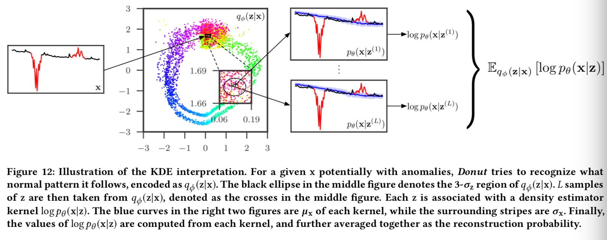

For a partially abnormal x*, the dimension reduction would allow Donut to recognize its normal pattern x ̃ , and cause qφ (z|x) to be approximately qφ (z|x ̃ ). This effect is caused by the following reasons. Donut is trained to reconstruct normal points in training samples with best efforts, while the dimension reduction causes Donut to be only able to capture a small amount of information from x. As a result, only the overall shape is encoded in qφ (z|x). The abnormal information is likely to be dropped in this procedure. However, if a x is too abnormal, Donut might fail to recognize any normal x ̃ , such that qφ (z|x) would become ill-defined.
> 对于部分异常的x*，减小尺寸将使Donut能够识别其正常模式x，并使qφ（z | x）近似为qφ（z | x ̃）。 此效果是由以下原因引起的。 训练了Donut以最大的努力重建训练样本中的正常点，而维数减少导致Donut仅能够从x捕获少量信息。 结果，只有整体形状被编码为qφ（z | x）。 在此过程中可能会丢弃异常信息。 但是，如果x太异常，则Donut可能无法识别任何正常的x ̃，从而使qφ（z | x）变得不确定。

*We call a x partially abnormal if only a small portion of points within x are abnormal, such that we can easily tell what normal pattern x should follow.
> 如果x内只有一小部分点是异常的，我们称x为部分异常，这样我们就可以轻松判断x应该遵循什么正常模式。

The fact that qφ (z|x) for a partially abnormal x would be similar to qφ (z|x ̃ ) brings special meanings to the reconstruction probability in Donut. Since M-ELBO is maximized with regard to normal pat- terns during training, log pθ (x|z) for z ∼ qφ (z|x ̃ ) should produce high scores for x similar to x ̃ , and vise versa. That is to say, each log pθ (x|z) can be used as a density estimator, indicating how well x follows the normal pattern x ̃. The posterior expectation then sums up the scores from all log pθ (x|z), with the weight qφ (z|x) for each z. This procedure is very similar to weighted kernel density estimation [11, 14]. We thus carry out the KDE interpretation: the reconstruction probability Eqφ (z |x) [log pθ (x|z)] in Donut can be seen as weighted kernel density estimation, with qφ (z|x) as weights and logpθ (x|z) as kernels* .

> 对于部分异常x的qφ（z | x）类似于qφ（z | x ̃）的事实为Donut中的重建概率带来了特殊的含义。 由于在训练过程中M-ELBO相对于正常模式是最大化的，因此z〜qφ（z | x ̃）的logpθ（x | z）应该为x产生高分，类似于x high，反之亦然。 也就是说，每个logpθ（x | z）都可以用作密度估计值，表示x遵循正常模式x ̃的程度。 然后，后验期望将所有logpθ（x | z）的得分相加，并对每个z赋权重qφ（z | x）。 该过程与加权核密度估计[11，14]非常相似。 因此，我们进行了KDE解释：可以将Donut中的重建概率Eqφ（z | x）[logpθ（x | z）]视为加权核密度估计，其中qφ（z | x）为权重，logpθ（x | z）作为内核*。

*The weights qφ (z|x) are implicitly applied by sampling in Monte Carlo integration.
> 权重qφ（z | x）通过蒙特卡洛积分中的采样隐式应用。

Fig 12 is an illustration of the KDE interpretation. We also visu- alize the 3-d latent spaces of all datasets in Fig 13. From the KDE interpretation, we suspect the prior expectation would not work well, whatever technique is adopted to improve the result: sampling on the prior should obtain kernels for all patterns of x, potentially confusing the density estimation for a particular x.
> 图12是KDE解释的示意图。 我们还可视化了图13中所有数据集的3-d潜在空间。从KDE解释中，我们怀疑采用任何技术改善结果的先验期望都不能很好地发挥作用：对先验采样应该获得用于 x的所有模式，可能会混淆特定x的密度估计。

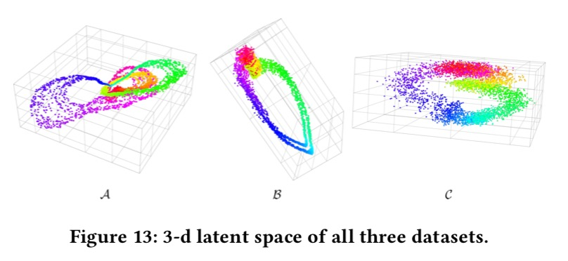

5.2 Find Good Posteriors for Abnormal x
> 为异常的X寻找好的后验

Donut can recognize the normal pattern of a partially abnormal x, and find a good posterior for estimating how well x follows the normal pattern. We now analyze how the techniques in Donut can enhance such ability of finding good posteriors.
> Donut可以识别出部分异常x的正常模式，并找到一个很好的后验估计x遵循正常模式的程度。 现在我们分析Donut中的技术如何增强发现后验的能力。

Donut is forced to reconstruct normal points within abnormal windows correctly during training, by M-ELBO. It is thus explic- itly trained to find good posteriors. This is the main reason why M-ELBO plays a vital role in Fig 9. Missing data injection ampli- fies the effect of M-ELBO, with synthetically generated missing points. On the other hand, MCMC imputation does not change the training process. Instead, it improves the detection, by iteratively approaching better posteriors, as illustrated in Fig 14.
> 在M-ELBO训练期间，Donut被迫正确地重建异常窗口内的normal点。 因此，对它进行了专门的训练以找到优秀的后验。 这是M-ELBO在图9中起至关重要的作用的主要原因。缺少数据注入会通过综合生成的缺失点放大M-ELBO的效果。 另一方面，MCMC推断不会改变训练过程。 相反，它通过迭代接近更好的后验来改善检测，如图14所示。

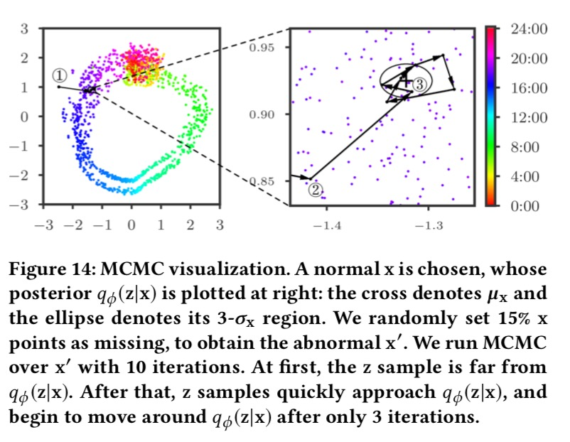

Despite these techniques, Donut may still fail to find a good posterior, if there are too many anomalies in x. In our scenario, the KPIs are time sequences, with one point per minute. For long- lasting anomalies, having the correct detection scores and raise alerts at first few minutes are sufficient in our context5. The op- erators can take action once any score reaches the threshold, and simply ignore the following inaccurate scores. Nevertheless, the KDE interpretation can help us know the limitations of re- construction probability, in order to use it properly.
> 尽管有这些技术，但如果x中存在太多异常，Donut仍然可能找不到良好的后验。 在我们的方案中，KPI是时间序列，每分钟1点。 对于长期异常，在我们的情况下，具有正确的检测分数并在开始的几分钟内发出警报就足够了。 一旦任何分数达到阈值，操作员就可以采取措施，而忽略以下不正确的分数。 但是，KDE解释可以帮助我们了解重建概率的局限性，以便正确使用它。

5.3 Causes of Time Gradient
> 时间梯度的原因

In this section we discuss the causes of the time gradient effect. To simplify the discussion, let us assume training x are all normal, thus M-ELBO is now equivalent to the original ELBO. M-ELBO can then be decomposed into three terms as in Eqn (4) (we leave out some subscripts for shorter notation).

> 在本节中，我们讨论时间梯度效应的原因。 为了简化讨论，让我们假设训练集x都是正常的，因此M-ELBO现在等同于原始的ELBO。 然后，可以将M-ELBO分解为等式（4）中的三个术语（我们省略了一些下标来表示较短的符号）。

$\begin{equation}\begin{aligned}                                   \varsigma(x) &= \mathbb{E}_{q_\phi(z|x)}[\log p_\theta(x|z)+\log p_\theta(z)-\log q_\phi(z|x)]\\       &=\mathbb{E}[\log p_\theta(x|z)] + \mathbb{E}[\log p_\theta(z)] + \mathbb{H}[z|x]  \end{aligned} (4) \end{equation}$

The 1st term requires z samples from qφ (z|x) to have a high likeli- hood of reconstructing x. As a result, qφ (z|x) for x with dissimilar shapes are separated. The 2nd term causes qφ (z|x) to concentrate on N (0, I). The 3rd term, the entropy of qφ (z|x), causes qφ (z|x) to expand wherever possible. Recall the 2nd term sets a restricted area for qφ (z|x) to expand (see Fig 11c for the combination effect of the 2nd and 3rd term). Taking the 1st term into account, this expansion would also stop if qφ (z|x) for two dissimilar x reach each other. In order for every qφ (z|x) to have a maximal territory when training converges (i.e., these three terms reach an equilibrium), similar x would have to get close to each other, allowing qφ (z|x) to grow larger with overlapping boundaries. Since contiguous x are similar in seasonal KPIs (and vise versa), the time gradient would be a natural consequence, if such equilibrium could be achieved.
> 第一项要求qφ（z | x）中的z个样本具有重构x的高可能性。 结果，分离了形状不同的x的qφ（z | x）。 第二项使qφ（z | x）集中于N（0，I）。 第三项，即qφ（z | x）的熵，使qφ（z | x）尽可能扩大。 回想一下，第二项为qφ（z | x）设置了扩展的限制区域（关于第二项和第三项的组合效果，请参见图11c）。 考虑到第一项，如果两个不同x的qφ（z | x）彼此达到，则该扩展也将停止。 为了使每个qφ（z | x）在训练收敛时具有最大的范围（即，这三个项达到平衡），相似的x必须彼此靠近，从而使qφ（z | x）变大 边界重叠。 由于连续的x在季节性KPI中相似（反之亦然），因此，如果可以实现这种平衡，则时间梯度将是自然的结果。

Next we discuss how the equilibrium could be achieved. The SGVB algorithm keeps pushing qφ (z|x) for dissimilar x away during training, as illustrated in Fig 15. The more dissimilar two qφ (z|x) are, the further they are pushed away. Since we initialize the variational network randomly, qφ (z|x) are mixed everywhere when training just begins, as Fig 11b shows. At this time, every qφ (z|x) are pushed away by all other qφ (z|x). Since x are sliding windows of KPIs, any pair of x far away in time will be generally more dissimilar, thus get pushed away further from each other. This gives qφ (z|x) an initial layout. As training goes on, the time gradient is fine-tuned and gradually established, as Fig 16a shows. The training dynamics also suggest that the learning rate annealing technique is very important, since it can gradually stabilize the layout.
> 接下来，我们讨论如何实现平衡。 如图15所示，SGVB算法会在训练过程中不断将xφ（z | x）推开，如图15所示。两个不同的qφ（z | x）越多，推开距离就越远。 由于我们随机地初始化了变分网络，因此如图11b所示，当训练刚开始时，qφ（z | x）随处可见。 此时，每个qφ（z | x）被所有其他qφ（z | x）推开。 由于x是KPI的滑动窗口，因此时间上相隔甚远的x对通常会更加相似，因此彼此之间的距离会越来越远。 这为qφ（z | x）提供了初始布局。 随着训练的进行，时间梯度将被微调并逐渐建立，如图16a所示。 训练动力学还表明，学习速率退火技术非常重要，因为它可以逐渐稳定布局。

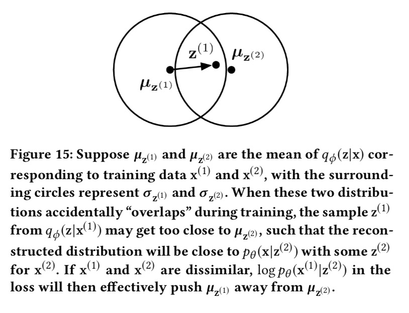

Surprisingly, we cannot find any term in M-ELBO that directly pulls qφ (z|x) for similar x together. The time gradient is likely to be caused mainly by expansion (H [z|x]), squeezing (E [log pθ (z)]), pushing (E [log pθ (x|z)]), and the training dynamics (random ini- tialization and SGVB). This could sometimes cause trouble, and result in sub-optimal layouts, as we shall see in § 5.4.
> 令人惊讶的是，我们在M-ELBO中找不到任何将相似x的qφ（z | x）直接拉在一起的项。 时间梯度可能主要由膨胀（H [z | x]），挤压（E [logpθ（z）]），推动（E [logpθ（x | z）]）和训练动力学引起。 （随机初始化和SGVB）。 正如我们将在5.4节中看到的那样，这有时可能会引起麻烦，并导致布局欠佳。

5.4 Sub-Optimal Equilibrium
> 次优均衡

qφ(z|x) may sometimes converge to a sub-optimal equilibrium. Fig 16b demonstrates such a problem, where the purple points accidentally get through the green points after the first 100 steps. The purple points push the green points away towards both sides, causing the green points to be totally cut off at around 5000 steps. As training goes on, the green points will be pushed even further, such that the model is locked to this sub-optimal equilibrium and never escapes. Fig 17 plots the training and validation loss of Fig 16b. Clearly, the model begins to over-fit soon after the green points are separated into halves. Such bad layout of z breaks the time gradient, where a testing x following green patterns might accidentally be mapped to somewhere between the green two halves and get recognized as purple. This would certainly downgrade the detection performance, according to the KDE interpretation.
> qφ（z | x）有时可能收敛于次优平衡。 图16b演示了这样一个问题，在最初的100个步骤之后，紫色点偶然穿过绿色点。 紫色点将绿色点推向两侧，导致绿色点以大约5000步被完全切断。 随着训练的进行，绿点将被进一步推动，以使模型被锁定在该次优均衡状态，并且永不逃脱。 图17绘制了图16b的训练和验证损失。 显然，在将绿点分成两半后，模型很快就开始过拟合。 z的这种不良布局破坏了时间梯度，在这种情况下，遵循绿色模式的测试x可能会意外地映射到绿色两半之间的某处并被识别为紫色。 根据KDE的解释，这肯定会降低检测性能。

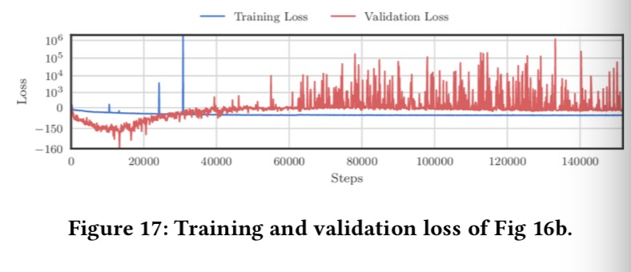

When there are unlabeled anomalies, the training would become unstable so that the model might be accidentally brought out of a sub-optimal equilibrium and achieve a better equilibrium after- wards. With the help of early-stopping during training, the best encountered equilibrium is chosen eventually. This explains why sometimes having complete labels would not benefit the perfor- mance. This effect is likely to be less obvious with larger K, since having more dimensions gives qφ (z|x) extra freedom to grow, re- ducing the chance of bad layouts. When sub-optimal equilibrium is not a vital problem, the convergence of training then becomes more important, while having more labels definitely helps stabilize the training. In conclusion, using anomaly labels in Donut is likely to benefit the performance, as long as K is adequately large.
> 当存在未标记的异常时，训练将变得不稳定，因此该模型可能会意外地脱离次优平衡状态，并在之后达到更好的平衡状态。 在训练过程中尽早停止，最终选择了最佳的平衡。 这就解释了为什么有时拥有完整的标签不会对性能有所帮助。 对于较大的K，此效果可能不太明显，因为具有较大的尺寸会给qφ（z | x）额外的自由生长空间，从而减少不良布局的可能性。 当次优均衡不是至关重要的问题时，训练的收敛性就变得更加重要，而拥有更多标签肯定有助于稳定训练。 总之，只要K足够大，在Donut中使用异常标签很可能会提高性能。

6 DISCUSSION
> 讨论

6.1 Broader Implications
> 更广泛的含义

Reconstruction. The dimension reduction in Donut throws away information of abnormal points. This implies that z for abnormal x might be indistinguishable from normal ones, thus cannot be used directly to detect anomalies. As a result, the reconstruction is thus an essential step in Donut. We believe this conclusion is also true in other algorithms involving dimension reduction. For example, the performance of PCA-based anomaly detection [19, 20, 33] is sensitive to the number of principle components. We suspect that using the reconstructed samples (as done in Donut) from these components could remove this sensitivity.
> 重建。 Donut的维度减小会丢弃异常点的信息。这意味着异常x的z可能与正常x不可区分，因此不能直接用于检测异常。因此，重建是Donut中必不可少的步骤。我们相信这个结论在涉及降维的其他算法中也是正确的。例如，基于PCA的异常检测[19、20、33]的性能对主成分的数量很敏感。我们怀疑使用这些组件中的重建样本（在Donut中完成）会消除这种敏感性。

KDE interpretation is the heart of Donut. We suspect this in- terpretation can also benefit the design of other deep generative models in anomaly detection. Meanwhile, the techniques of this pa- per (i.e., M-ELBO, missing data injection and MCMC) are designed to enhance the ability of finding good posteriors according to ab- normal x, needed by the density estimation step. These techniques are also readily applicable to other deep generative models.
> KDE解释是Donut的核心。我们怀疑这种解释也可能有益于异常检测中其他深度生成模型的设计。同时，设计该文件的技术（即M-ELBO，丢失数据注入和MCMC）以增强根据密度估计步骤所需的异常x找到良好后验的能力。这些技术也很容易适用于其他深度生成模型。

The time gradient effect may take place in more general types of seasonal or periodical sequences, rather than just the seasonal KPIs. Similar x are mapped to neighborhood qφ(z|x), such that Donut or its variants might potentially be useful in tasks dealing with similarities of sequences, in addition to anomaly detection, e.g., retrieving similar curves from a large database.
> 时间梯度效应可能发生在更普遍的季节性或周期性序列类型中，而不仅仅是季节性KPI。相似的x映射到邻域qφ（z | x），因此除了异常检测（例如从大型数据库中检索相似的曲线）之外，Donut或其变体在处理序列相似性的任务中可能很有用。

6.2 Future Work
> 未来工作

As mentioned in § 4.6, we leave the task of choosing K as future work. The topology of z might be a key for solving this problem, as we have seen how sub-optimal equilibriums might affect the per- formance (see § 5.4). Also, we suspect the sub-optimal equilibriums might be less likely to take place with large K, although we may still need more experiments and analysis to prove this.
> 如第4.6节所述，我们将选择K作为未来工作的任务。 z的拓扑可能是解决此问题的关键，因为我们已经看到次优均衡可能如何影响性能（请参见第5.4节）。 此外，尽管我们可能仍需要更多的实验和分析来证明这一点，但我们怀疑在大K条件下不太可能发生次优平衡。

We did not discuss how to choose the right threshold for detec- tion. This is also a quite difficult problem, especially in the unsu- pervised scenario. Some work (e.g., [21]) have been proposed w.r.t. choosing a proper threshold, which might be applicable to Donut.
> 我们没有讨论如何选择正确的检测阈值。 这也是一个相当困难的问题，尤其是在未预料到的情况下。 w.r.t.提出了一些工作（例如[21]）。 选择适当的阈值，这可能适用于Donut。

More complicated architectures may be adopted to extend Donut. For example, the sequence-to-sequence RNN architecture [38] may be used to replace the fully connected layers in Donut, so as to handle larger windows, and to deal better with the correlations across points.
> 可以采用更复杂的体系结构来扩展Donut。 例如，序列到序列的RNN体系结构[38]可用于替换Donut中的完全连接的层，以便处理更大的窗口，并更好地处理跨点的相关性。

7 CONCLUSION
> 结论

In this paper, we proposed an unsupervised anomaly detection algo- rithm Donut based on VAE for seasonal KPIs with local variations. The new techniques enabled Donut to greatly outperform state-of- art supervised and VAE-based anomaly detection algorithms. The best F-scores of Donut range from 0.75 to 0.90 for the studied KPIs.
> 在本文中，我们提出了一种基于VAE的无监督异常检测算法Donut，用于具有局部变化的周期KPI。 新技术使Donut能够大大胜过最新的监督和基于VAE的异常检测算法。 对于所研究的KPI，甜甜圈的最佳F分数范围为0.75至0.90。

Donut’s excellent performance are explained by our theoretical analysis with KDE interpretation and the new discovery of the time gradient effect. Our experimental and theoretical analyses imply broader impacts: anomaly detection based on dimension reduction needs to use reconstruction; anomaly detection with generative models needs to train with both normal and abnormal data.
> 通过对KDE的理论分析和对时间梯度效应的新发现，可以解释Donut的出色性能。 我们的实验和理论分析暗示了更广泛的影响：基于降维的异常检测需要使用重构； 生成模型的异常检测需要训练正常和异常数据。

8 ACKNOWLEDGEMENTS
> 感谢

The work was supported by National Natural Science Foundation of China (NSFC) under grant No. 61472214 and No. 61472210, and Alibaba Innovative Research (AIR). We also thank Prof. Jun Zhu and his PhD. student Jiaxin Shi for helpful and constructive discussions.
> 这项工作得到了国家自然科学基金（NSFC）的资助，资助号为61472214和61472210，以及阿里巴巴创新研究（AIR）。 我们还要感谢朱俊教授和他的博士。 学生Shi Jiaxin进行有益和建设性的讨论。

REFERENCES

[1] Mennatallah Amer, Markus Goldstein, and Slim Abdennadher. 2013. Enhanc- ing one-class support vector machines for unsupervised anomaly detection. In Proceedings of the ACM SIGKDD Workshop on Outlier Detection and Description. ACM, 8–15.

[2] Jinwon An and Sungzoon Cho. 2015. Variational Autoencoder based Anomaly Detection using Reconstruction Probability. Technical Report. SNU Data Mining Center. 1–18 pages.

[3] Matthew James Beal. 2003. Variational algorithms for approximate Bayesian inference. University of London London.

[4] Christopher M Bishop. 2006. Pattern recognition and machine learning. springer. [5] Varun Chandola, Arindam Banerjee, and Vipin Kumar. 2009. Anomaly detection:
A survey. ACM computing surveys (CSUR) 41, 3 (2009), 15.

[6] Yingying Chen, Ratul Mahajan, Baskar Sridharan, and Zhi-Li Zhang. 2013. A
Provider-side View of Web Search Response Time. In Proceedings of the ACM SIGCOMM 2013 Conference on SIGCOMM (SIGCOMM ’13). ACM, New York, NY, USA, 243–254. https://doi.org/10.1145/2486001.2486035

[7] SarahMErfani,SutharshanRajasegarar,ShanikaKarunasekera,andChristopher Leckie. 2016. High-dimensional and large-scale anomaly detection using a linear one-class SVM with deep learning. Pattern Recognition 58 (2016), 121–134.

[8] Romain Fontugne, Pierre Borgnat, Patrice Abry, and Kensuke Fukuda. 2010. MAWILab: Combining Diverse Anomaly Detectors for Automated Anomaly Labeling and Performance Benchmarking. In Proceedings of the 6th International COnference (Co-NEXT ’10). ACM, Article 8, 12 pages. https://doi.org/10.1145/ 1921168.1921179

[9] ZhouyuFu,WeimingHu,andTieniuTan.2005.Similaritybasedvehicletrajectory clustering and anomaly detection. In Image Processing, 2005. ICIP 2005. IEEE International Conference on, Vol. 2. IEEE, II–602.

[10] JohnGeweke.1989.BayesianinferenceineconometricmodelsusingMonteCarlo integration. Econometrica: Journal of the Econometric Society (1989), 1317–1339. 

[11] Francisco J Goerlich Gisbert. 2003. Weighted samples, kernel density estimators
and convergence. Empirical Economics 28, 2 (2003), 335–351. 

[12] Ian Goodfellow, Yoshua Bengio, and Aaron Courville. 2016. Deep Learning. MIT
Press.

[13] IanGoodfellow,JeanPouget-Abadie,MehdiMirza,BingXu,DavidWarde-Farley,
Sherjil Ozair, Aaron Courville, and Yoshua Bengio. 2014. Generative adversarial
nets. In Advances in neural information processing systems. 2672–2680.

[14] Wolfgang Härdle, Axel Werwatz, Marlene Müller, and Stefan Sperlich. 2004. Nonparametric density estimation. Nonparametric and Semiparametric Models
(2004), 39–83.

[15] Diederik Kingma and Jimmy Ba. 2014. Adam: A method for stochastic optimiza-
tion. arXiv preprint arXiv:1412.6980 (2014).

[16] Diederik P Kingma and Max Welling. 2014. Auto-Encoding Variational Bayes. In
Proceedings of the International Conference on Learning Representations.

[17] Florian Knorn and Douglas J Leith. 2008. Adaptive kalman filtering for anomaly
detection in software appliances. In INFOCOM Workshops 2008, IEEE. IEEE, 1–6. [18] BalachanderKrishnamurthy,SubhabrataSen,YinZhang,andYanChen.2003. Sketch-based change detection: methods, evaluation, and applications. In Pro- ceedings of the 3rd ACM SIGCOMM conference on Internet measurement. ACM,
234–247.

[19] Anukool Lakhina, Mark Crovella, and Christophe Diot. 2004. Diagnosing
Network-wide Traffic Anomalies. In Proceedings of the 2004 Conference on Appli- cations, Technologies, Architectures, and Protocols for Computer Communications (SIGCOMM ’04). ACM, New York, NY, USA, 219–230. https://doi.org/10.1145/ 1015467.1015492

[20] Anukool Lakhina, Mark Crovella, and Christophe Diot. 2005. Mining Anom- alies Using Traffic Feature Distributions. In Proceedings of the 2005 Confer- ence on Applications, Technologies, Architectures, and Protocols for Computer Communications (SIGCOMM ’05). ACM, New York, NY, USA, 217–228. https: //doi.org/10.1145/1080091.1080118 

[21] Nikolay Laptev, Saeed Amizadeh, and Ian Flint. 2015. Generic and scalable framework for automated time-series anomaly detection. In Proceedings of the 21th ACM SIGKDD International Conference on Knowledge Discovery and Data Mining. ACM, 1939–1947.

[22] Alexander Lavin and Subutai Ahmad. 2015. Evaluating Real-Time Anomaly Detection Algorithms–The Numenta Anomaly Benchmark. In Machine Learning and Applications (ICMLA), 2015 IEEE 14th International Conference on. IEEE, 38– 44.

[23] RikardLaxhammar,GoranFalkman,andEgilsSviestins.2009.Anomalydetection in sea traffic-a comparison of the gaussian mixture model and the kernel density estimator. In Information Fusion, 2009. FUSION’09. 12th International Conference on. IEEE, 756–763.

[24] Suk-BokLee,DanPei,MohammadTaghiHajiaghayi,IoannisPefkianakis,Songwu Lu, He Yan, Zihui Ge, Jennifer Yates, and Mario Kosseifi. 2012. Threshold com- pression for 3g scalable monitoring. In INFOCOM, 2012 Proceedings IEEE. IEEE, 1350–1358.

[25] DapengLiu,YoujianZhao,HaowenXu,YongqianSun,DanPei,JiaoLuo,Xiaowei Jing, and Mei Feng. 2015. Opprentice: Towards Practical and Automatic Anomaly Detection Through Machine Learning. In Proceedings of the 2015 ACM Conference on Internet Measurement Conference (IMC ’15). ACM, New York, NY, USA, 211–224. https://doi.org/10.1145/2815675.2815679 

[26] Wei Lu and Ali A Ghorbani. 2009. Network anomaly detection based on wavelet analysis. EURASIP Journal on Advances in Signal Processing 2009 (2009), 4.

[27] AjayMahimkar,ZihuiGe,JiaWang,JenniferYates,YinZhang,JoanneEmmons,
Brian Huntley, and Mark Stockert. 2011. Rapid detection of maintenance induced changes in service performance. In Proceedings of the Seventh COnference on emerging Networking EXperiments and Technologies. ACM, 13.

[28] Gerhard Münz, Sa Li, and Georg Carle. 2007. Traffic anomaly detection using k-means clustering. In GI/ITG Workshop MMBnet.

[29] Miguel Nicolau, James McDermott, et al. 2016. One-Class Classification for Anomaly Detection with Kernel Density Estimation and Genetic Programming. In European Conference on Genetic Programming. Springer, 3–18.

[30] Thomas Dyhre Nielsen and Finn Verner Jensen. 2009. Bayesian networks and decision graphs. Springer Science & Business Media.

[31] BrandonPincombe.2005.Anomalydetectionintimeseriesofgraphsusingarma processes. Asor Bulletin 24, 4 (2005), 2.

[32] Danilo Jimenez Rezende, Shakir Mohamed, and Daan Wierstra. 2014. Stochastic Backpropagation and Approximate Inference in Deep Generative Models. In Proceedings of the 31st International Conference on International Conference on Machine Learning - Volume 32 (ICML’14). JMLR.org, Beijing, China, II–1278–II– 1286.

[33] HaakonRingberg,AugustinSoule,JenniferRexford,andChristopheDiot.2007. Sensitivity of PCA for Traffic Anomaly Detection. In Proceedings of the 2007 ACM SIGMETRICS International Conference on Measurement and Modeling of Computer Systems (SIGMETRICS ’07). ACM, New York, NY, USA, 109–120. https: //doi.org/10.1145/1254882.1254895 

[34] Terrence J Sejnowski and Charles R Rosenberg. 1987. Parallel networks that learn to pronounce English text. Complex systems 1, 1 (1987), 145–168.

[35] ShashankShanbhagandTilmanWolf.2009.Accurateanomalydetectionthrough parallelism. Network, IEEE 23, 1 (2009), 22–28.

[36] MaximilianSölch,JustinBayer,MarvinLudersdorfer,andPatrickvanderSmagt. 2016. Variational inference for on-line anomaly detection in high-dimensional time series. International Conference on Machine Laerning Anomaly detection Workshop (2016).

[37] JonathanACSterne,IanRWhite,JohnBCarlin,MichaelSpratt,PatrickRoyston, Michael G Kenward, Angela M Wood, and James R Carpenter. 2009. Multiple imputation for missing data in epidemiological and clinical research: potential and pitfalls. Bmj 338 (2009), b2393.

[38] IlyaSutskever,OriolVinyals,andQuocVLe.2014.Sequencetosequencelearning with neural networks. In Advances in neural information processing systems. 3104– 3112.

[39] Hao Wang and Dit-Yan Yeung. 2016. Towards Bayesian deep learning: A survey. arXiv preprint arXiv:1604.01662 (2016).

[40] Asrul H Yaacob, Ian KT Tan, Su Fong Chien, and Hon Khi Tan. 2010. Arima based network anomaly detection. In Communication Software and Networks, 2010. ICCSN’10. Second International Conference on. IEEE, 205–209.

[41] He Yan, Ashley Flavel, Zihui Ge, Alexandre Gerber, Dan Massey, Christos Pa- padopoulos, Hiren Shah, and Jennifer Yates. 2012. Argus: End-to-end service anomaly detection and localization from an ISP’s point of view. In INFOCOM, 2012 Proceedings IEEE. IEEE, 2756–2760.
